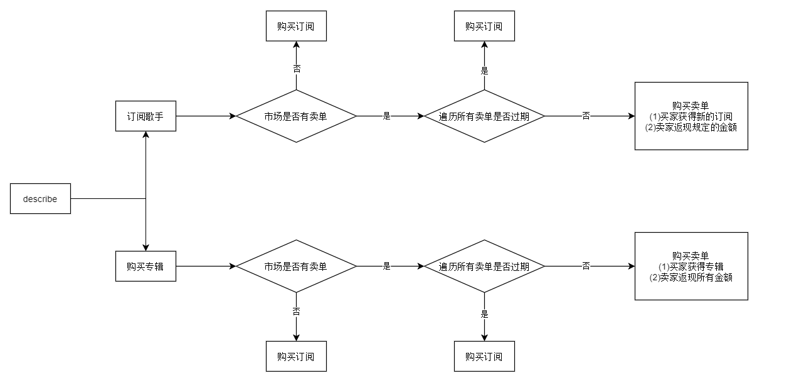

# web3音乐平台

## 简介

主题：数字权益，数字文旅

当前听歌存在的问题：目前国内的听歌软件，某些歌手的歌只能在某些特定的平台才能听，用户想要听其他歌只能换平台，用户体验感很差

我们旨在：建立一个音乐接口平台，探索统一听歌的模式，使得用户在付费一次之后，在各大平台均可享受同样的听歌服务。

## 项目架构

- 歌手：价值产生
- 用户：一次购买，全平台听歌
- 音乐平台：需要权衡投资与歌手签约
- cha1n0n音乐平台：中间人，区块链世界与现实世界的媒介
- 合约：管理数据


## 经济模型

- 用户

  - 听歌更加方便，在cha1n0n音乐平台进行一次付费，即可在所有的音乐平台听歌。比如：订阅了歌手A，那么在各大音乐平台均可享受到歌手A的歌曲。
  - 订阅歌手时间目前有两个选项：3/6个月，订阅期间之内，如果不想订阅则可以转售，并且按时间消耗进行返现。购买专辑目前是永久，并且可以以原价进行转售

- 歌手

  - 更多的用户可以听到他的歌曲，得到更多的发展

  - 任何人都可以成为歌手，但是只有和cha1n0n音乐平台联络好之后，才可以参与资金分配

  - 相比于传统的商业模式，歌手的收入只会更高

    > 以前的独播权模式：买断了一个歌手后，其他平台无法播放。无法做到qq音乐出90万，网易云出10万，然后都可以播放周杰伦的歌，用户如果都跑到网易云的平台的话qq音乐就亏了，因此qq音乐觉得不公平。然而现在模式变了，是在资金池子分取金额，用户把钱给到接口平台的池子。比如所有听周杰伦的歌的人都把钱放到了池子里面，然后根据比例，qq音乐在池子存了90万，网易云存了10万，这100万会给到歌手，那么最终收益qq音乐拿9成，网易云拿1成。很少说qq音乐一个平台就可以买断一个歌手，比如qq音乐出100万，那其他音乐平台加起来，肯定是不会少于100万的吧，那么周杰伦肯定选择其他所有平台，qq音乐就被淘汰出局。歌手的收益只会多，不会少，因为各个平台都想占更大的比例，会投资更多。

- 音乐平台

  - 无需再花时间来抢独播权，专注于用户体验和软件开发
  - 颠覆传统的商业模式，目前修改成投资+经营模式。在每一轮投资的时候，选择好歌手与投资比例，参与到最终的市场分配

- cha1n0n音乐平台

  - 作为音乐平台、歌手、用户三者的协调者
  - 为了方便用户与歌手相当于传统模式的交互模式，提供了代理模式：歌手与用户提供地址与法币，平台收取少量手续费，帮助其完成所有上链操作。当然他们可以自己进行操作，自主与区块链交互。

- 合约

  - 每一轮投资开始：各个音乐公司发送资金到合约并通知cha1n0n音乐平台地址，然后cha1n0n音乐平台统一进行投资上链操作
  - 等到一个投资周期结束，cha1n0n音乐平台进行资金分成，发送数字资产到歌手与音乐平台提供的地址：
    - 投资池子：歌手获得80%，cha1n0n音乐平台获得20%手续费
    - 充值池子：歌手获得15%，cha1n0n音乐平台获得5%手续费，2/3为各大音乐平台根据投资占比、1/3为平台流量占比进行分配剩余的80%金额
  - 音乐公司与音乐人得到的是数字资产，如果想要获取法币，可再与cha1n0n音乐平台进行交换
  - 每一轮投资周期并没有写入区块链，暂定每3个月进行一轮投资
  - 音乐平台需要权衡风险，估摸市场，对适合的歌手进行投资。因为订阅歌手是3/6个月，并且专辑价格稍高，因此充值池中的资金的源源不断的，音乐平台预测市场并且抢占投资池子比例以此获得充值池子的更多回报。

## 合约函数

- 订阅歌手（3/6个月）或购买专辑（永久）
  - _singer：歌手
  - _albumName：专辑名，若是订阅歌手，则设置为`hex"00000000"`
  - _choice：0为订阅歌手6个月，其余为订阅3个月

```solidity
function describe(address _singer, bytes4 _albumName, uint256 _choice) external payable
```



- 查看某个用户是否订阅了某个歌手或者购买了某个专辑
  - _user：用户
  - _singer：歌手
  - _albumName：专辑名，若是订阅歌手，则设置为`hex"00000000"`

```solidity
function isDescribe(address _user, address _singer, bytes4 _albumName) public view returns(bool)
```


- 用户将订阅的歌手或者专辑，提交订单到市场，等待别人购买
  - _singer：歌手
  - _albumName：专辑名，若是订阅歌手，则设置为`hex"00000000"`

```solidity
function transferUserRightPending(address _singer, bytes4 _albumName) external
```


- 歌手设置自己的订阅价格和专辑的价格
  - _price：订阅歌手的价格或专辑价格
  - _albumName：专辑名，若是订阅歌手，则设置为`hex"00000000"`

```solidity
function updateSongAndAlbum(uint256 _price,  bytes4 _albumName) external
```

- 分配投资与充值
  - _singer：歌手
  - _musicPlatform：各音乐平台
  - _molecular：流量的分子
  - _Denominator：流量的分母

```solidity
function allocMoney(
    address[] memory _singer, 
    address[][] memory _musicPlatform, 
    uint256[][] memory _molecular, 
    uint256[] memory _Denominator
) external onlyOwner
```

- 操作投资池，只有owner可以调用，音乐平台给接口平台发钱，接口平台来调用这个方法
  - _musicPlatform：音乐平台地址
  - _singer：歌手地址
  - amount：投资额度

```solidity
function investSinger(
        address[] calldata _musicPlatform, 
        address[] calldata _singer, 
        uint256[][] calldata amount
    ) external payable onlyOwner
```

- 计算充值池收益：歌手收益、音乐平台收益、接口平台手续费
  - _singer：歌手
  - _musicPlatform：“音乐平台
  - _owner：owner，协助用于计算手续费
  - _molecular：流量的分子
  - _Denominator：流量的分母

```solidity
function calReward(
        address _singer, 
        address _musicPlatform, 
        address _owner, 
        uint256 _molecular, 
        uint256 _Denominator
    ) public view returns(uint256)
```

- 查看市场中有多少等待交易的音乐订单
  - _singer：歌手
  - _albumName：专辑名，若是订阅歌手，则设置为`hex"00000000"`

```solidity
function marketLength(address _singer, bytes4 _albumName) external view returns(uint256)
```

## 测试

1. 将项目clone下来
2. 安装相关，使用foundry开发工具
3. 测试：`forge test --offline`

```
PS E:\web3Competition\cha1n0n\contracts> forge test --offline
[⠔] Compiling...
No files changed, compilation skipped

Running 2 tests for test/Core.t.sol:CoreTest
[PASS] test_describe_transferRight() (gas: 1014840)
[PASS] test_investSinger_calReward() (gas: 733554)
Test result: ok. 2 passed; 0 failed; 0 skipped; finished in 2.44ms
Ran 1 test suites: 2 tests passed, 0 failed, 0 skipped (2 total tests)
```


